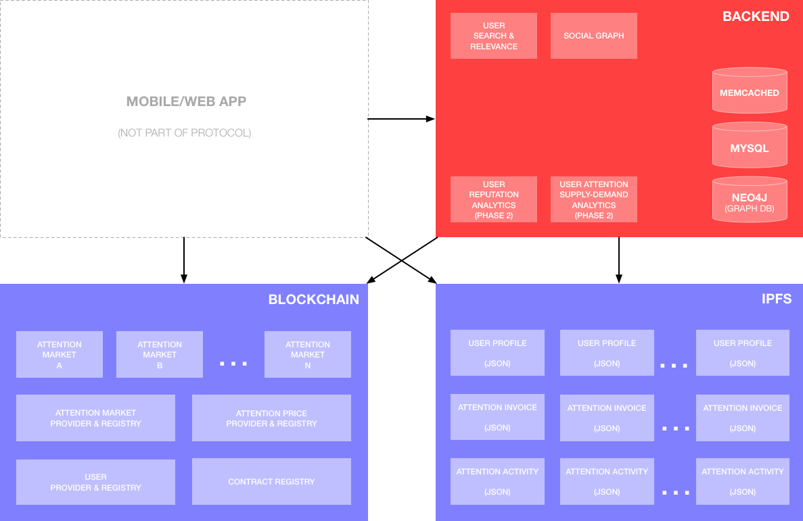
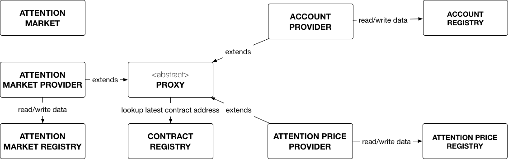
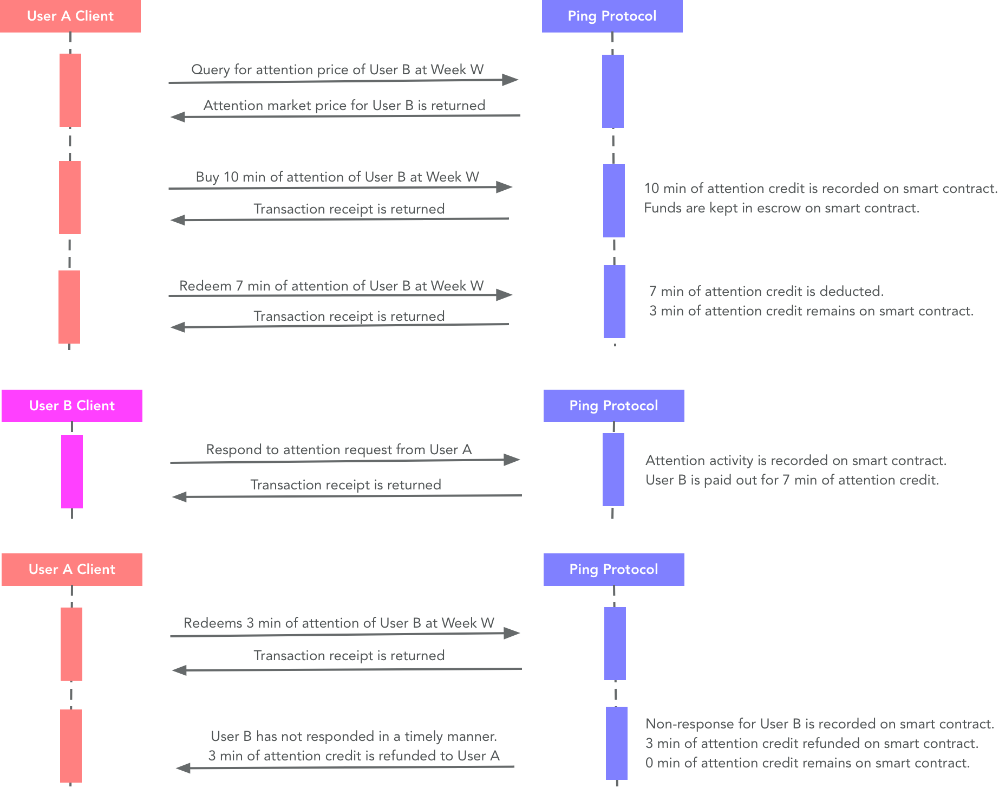

# Ping Protocol

The Ping Protocol is the backbone of the personal attention marketplace. It is a platform providing API and developer libraries to enable attention markets in client apps (mobile and web). Our vision for Ping is to have a wide variety of attention market applications built atop a common platform and attention pool.

## Assumptions

* **Attention is measured as a unit of time in minutes.** Obviously, attention is more complicated than that, but time is a measurement that everyone can relate and understand. 
* **A person has a limited supply of attention and it varies day-by-day.** An accurate day-by-day data of a person’s attention is difficult to obtain and is beyond the scope of the initial version of Ping Protocol. For our initial version, we are using a simplified model of asking the user the amount of weekly attention (in minutes) that the user wants to sell.
* **Attention price is driven by supply-demand.** As an individual’s weekly supply of attention is bought out, the attention price increases to reflect the lower supply. If the price is too low or too high, the demand of the user’s attention should adjust accordingly by market forces to stabilize the price.
* **Attention has a floor price.** If an individual’s attention price falls below a certain threshold, it is not worthwhile for that user to participate in the attention economy. Therefore, the user can set a floor price. However, if the floor price is too high, no one may buy his or her attention. We can recommend a floor price for the user based on comparative pricing from similar users.

## Core features

* **Buy and sell attention at market prices.** Buyers can purchase future attention of sellers at fair market prices, which are calculated at real-time by analyzing the supply and demand of seller's attention in the marketplace.
* **Social-attention graph.** As users connect to one another in our social graph and transact with one another with attention purchases and activities, we can form the world's first social-attention graph representing people's attention and influence with one another.
* **Subscribe to interested topics.** Users can subscribe to topics and activities that interest them, so they can spend their attention on things they care about.
* **Decentralized, open, and transparent.** All attention settlements are done peer-to-peer via smart contracts in the Ethereum blockchain, providing a decentralized, open, and transparent economy.

## Protocol architecture

The long-term vision of Ping protocol is a totally decentralized architecture. However, that vision is still a while away as blockchain technologies and tooling evolve to meet those goals. In the meantime, we are using a combination of on-chain and off-chain components:

* **Ethereum Blockchain (decentralized).** All transaction settlements (purchase, redemption, payout) are executed in the blockchain. Attention market business logic and state are contained in smart contracts in the blockchain, with each user having complete ownership over his or her contract instance and funds.
* **IPFS (decentralized).** Hierarchical data such as user profiles, attention invoices, and attention activities (e.g. messages and its responses) data are stored as JSON files in the IPFS to provide a decentralized datastore.
* **Cloud backend (centralized).** Services that are CPU-heavy or data-heavy with peformance constraints are better served on centralized backend servers rather than blockchain. These include search, analytics, and social graphs.

## Smart contracts

Github Repository: [https://github.com/PingAttentionMarket/ping-contracts](https://github.com/PingAttentionMarket/ping-contracts)

* **Attention Market contract.** Each instance of this contract represent the personal attention market of a seller. This is the access point for a buyer to purchase and redeem the attention of this seller.
* **Attention Market Provider contract.** Contains the business logic of personal attention markets. Also responsible for creating a new instance of personal attention market in the blockchain.
* **Attention Market Registry contract.** All personal attention markets needs to be registered here. This is the source of truth of who owns what personal attention market.
* **Account Provider contract.** Contains the business logic of an account. Also responsible for creating a new instance of account in the blockchain.
* **Acount Registry contract.** All account needs to be registered here. This is the source of truth of who owns what account.
* **Proxy contract.** An abstract contract for contract address lookup and delegation. This provides a robust contract upgrade mechanism.
* **Contract Registry contract.** All singleton contracts needs to be registered here. This is the source of truth of the latest-and-greatest contract. 

## Basic usages

